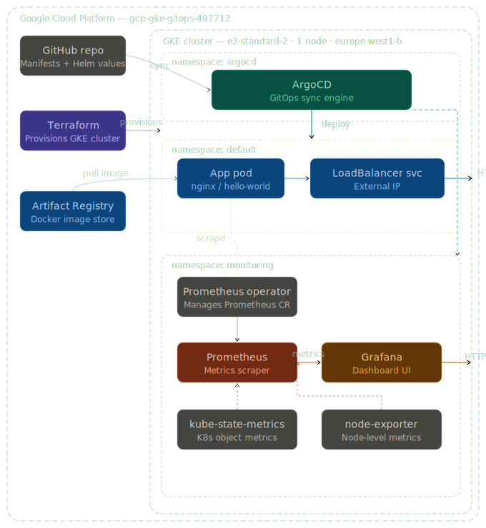
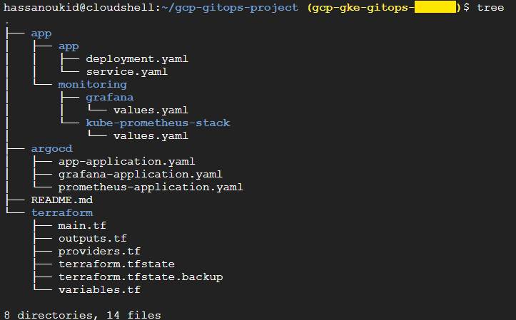
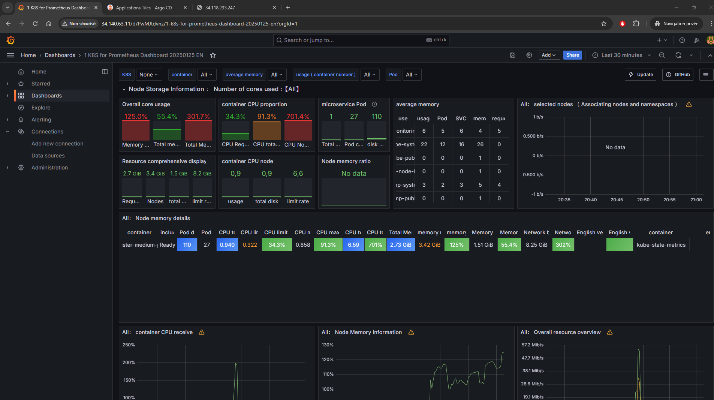

# GKE GitOps Platform

> Production-like GitOps platform on GCP — GKE cluster provisioned with Terraform, applications deployed via ArgoCD, monitored with Prometheus & Grafana.

---

## Overview

This project demonstrates a complete cloud-native infrastructure on **Google Cloud Platform**, built with modern DevOps practices. It combines Infrastructure as Code, GitOps continuous delivery, and full-stack observability into a minimal but production-representative platform.

The goal is to showcase real-world skills used in SRE and Cloud/DevOps engineering roles: provisioning repeatable infrastructure, automating deployments through Git, and monitoring cluster health with industry-standard tooling.

---

## Architecture




## Stack

| Layer | Tool | Purpose |
|---|---|---|
| Cloud Provider | Google Cloud Platform | Hosting and managed services |
| Infrastructure as Code | Terraform | Provision GKE cluster, node pool, Artifact Registry |
| Container Orchestration | GKE (Kubernetes) | Run and manage containerized workloads |
| GitOps Engine | ArgoCD | Sync Kubernetes state from Git automatically |
| Metrics Collection | Prometheus (kube-prometheus-stack) | Scrape cluster and application metrics |
| Observability UI | Grafana | Visualize metrics with pre-built dashboards |
| Image Registry | GCP Artifact Registry | Store and serve Docker images |
| Source Control | GitHub | Single source of truth for all manifests |

---


## Repository Structure

```
.
├── app/
│   ├── app/
│   │   ├── deployment.yaml          # nginx hello-world app
│   │   └── service.yaml             # LoadBalancer service
│   └── monitoring/
│       ├── grafana/
│       │   └── values.yaml          # Grafana Helm values
│       └── kube-prometheus-stack/
│           └── values.yaml          # Prometheus Helm values
├── argocd/
│   ├── app-application.yaml         # ArgoCD app for hello-world
│   ├── grafana-application.yaml     # ArgoCD app for Grafana
│   └── prometheus-application.yaml  # ArgoCD app for Prometheus
├── terraform/
│   ├── main.tf                      # GKE cluster + node pool + registry
│   ├── variables.tf
│   ├── outputs.tf
│   └── providers.tf
└── README.md
```



---

## Infrastructure Details

### GKE Cluster

- **Machine type:** `e2-standard-2` (2 vCPU, 8GB RAM)
- **Node count:** 1 (minimalist, cost-optimised for demo)
- **Zone:** `europe-west1-b`
- **Node pool:** Custom service account with least-privilege IAM

### Terraform Resources

- `google_container_cluster` — GKE cluster with custom node pool
- `google_container_node_pool` — Managed node pool with defined resource limits
- `google_artifact_registry_repository` — Docker image repository
- `google_service_account` + IAM bindings — Least-privilege node identity

### ArgoCD Applications

Three separate ArgoCD `Application` resources manage the full cluster state:

| App | Chart | Namespace |
|---|---|---|
| `hello-app` | Raw manifests from Git | `default` |
| `prometheus` | `kube-prometheus-stack` v57.0.3 | `monitoring` |
| `grafana` | `grafana` v7.3.7 | `monitoring` |

All apps use `automated` sync with `selfHeal: true` — any manual change to the cluster is automatically reverted to match Git.

### Observability

- **Prometheus** scrapes metrics from all pods, nodes, and Kubernetes control-plane components via `kube-state-metrics` and `node-exporter`
- **Grafana** is pre-configured with Prometheus as default datasource and loads the Kubernetes cluster overview dashboard (ID 15661) automatically on startup
- Prometheus runs as ephemeral storage (`storageSpec: {}`) with 6h retention — suitable for demo environments

---

## How to Deploy

### Prerequisites

- GCP project with billing enabled
- `gcloud` CLI authenticated
- `terraform` >= 1.5
- `kubectl`
- `helm` >= 3.x

### 1 — Provision infrastructure

```bash
cd terraform
terraform init
terraform plan
terraform apply
```

### 2 — Connect to the cluster

```bash
gcloud container clusters get-credentials gke-gitops-cluster \
  --zone europe-west1-b \
  --project gcp-gke-gitops-487712
```

### 3 — Install ArgoCD

```bash
kubectl create namespace argocd
kubectl apply -n argocd \
  -f https://raw.githubusercontent.com/argoproj/argo-cd/stable/manifests/install.yaml

# Get admin password
kubectl -n argocd get secret argocd-initial-admin-secret \
  -o jsonpath="{.data.password}" | base64 -d
```

### 4 — Deploy all applications

```bash
kubectl apply -f argocd/app-application.yaml
kubectl apply -f argocd/prometheus-application.yaml
kubectl apply -f argocd/grafana-application.yaml
```

ArgoCD will automatically sync and deploy everything from this repository.

### 5 — Access services

```bash

# ArgoCD UI
kubectl port-forward svc/argocd-server -n argocd 8080:443
# → https://localhost:8080


# Grafana external IP
kubectl get svc -n monitoring | grep grafana
# → http://<EXTERNAL-IP>  (admin / admin123)
```



---

## GitOps Workflow

```
Developer pushes to GitHub
         │
         ▼
   ArgoCD detects diff
   (polls every 3 min)
         │
         ▼
   ArgoCD syncs cluster
   state to match Git
         │
         ▼
   Kubernetes applies
   new manifests
         │
         ▼
   Prometheus scrapes
   new pod metrics
         │
         ▼
   Grafana reflects
   updated state
```

Any change to the cluster that does not come from Git is automatically reverted (`selfHeal: true`). Git is the **single source of truth**.

---

## Cost Management

To pause the cluster and preserve free credits:

```bash
# Scale to 0 nodes when not in use
gcloud container clusters resize gke-gitops-cluster \
  --node-pool default-pool \
  --num-nodes 0 \
  --zone europe-west1-b

# Full teardown
cd terraform && terraform destroy
```

---

## Author

**Hassan OULCAID** — Cloud | DevOps | SRE Engineer  
[hassan.oulcaid.com](https://hassan.oulcaid.com) · [LinkedIn](https://www.linkedin.com/in/hassan-oulcaid/) · [GitHub](https://github.com/HOulcaid)